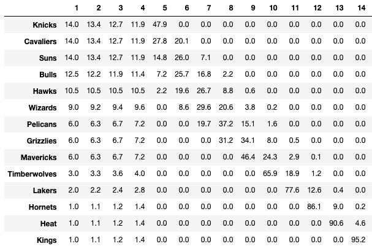

# nba_lottery
Tool to provide updated odds by team for the NBA lottery as teams are revealed

## Description
This repo contains a notebook (`nba_lottery.ipynb`) that constructs an NBA Draft Lottery odds tool that can be updated live as the draft order is being revealed. The pre-lottery odds of a team receiving a particular draft position is well-documented, but the odds do not update dynamically as information is learned. With the `Logo` class from the `py_ball` package, a table of updated NBA Draft Lottery odds can be generated via user input.

## Results
The table below shows the pre-lottery odds for the 2019 NBA Draft. Each cell contains the percent probability of the team in that row receiving the pick number in the column. When the tool is used dynamically, protected draft picks will change teams if conditions are met.

